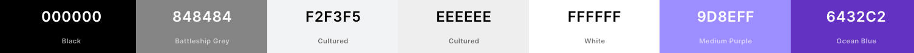

# Crep Chat Frontend

Developer: Tom Ainsworth

This repository contains the frontend React app for the fullstack application Crep Chat - a content site for trainer enthusiasts to chat about their favourite pairs.
Built using React.

Link to the backend repository [Crep Chat Backend](https://github.com/Tom-Ainsworth/crepchat-backend)

## Contents

- [Crep Chat Frontend](#crep-chat-frontend)

  - [Contents](#contents)

- [Crep Chat Frontend](#crep-chat-frontend)
  - [Contents](#contents)
  - [UX Design](#ux-design)
    - [Strategy Plane](#strategy-plane)
    - [Scope Plane](#scope-plane)
    - [Structure Plane](#structure-plane)
  - [User Stories](#user-stories)
    - [Profile](#profile)
    - [Posts](#posts)
    - [Comments](#comments)
    - [Likes](#likes)
    - [Followers](#followers)
    - [Reviews](#reviews)
    - [Skeleton Plane](#skeleton-plane)
      - [Wireframes](#wireframes)
    - [Surface Plane](#surface-plane)
      - [Colour Scheme](#colour-scheme)
      - [Typography](#typography)
  - [Agile Development Process](#agile-development-process)
  - [**Current Features**](#current-features)
  - [Future Development](#future-development)
  - [Testing](#testing)
  - [Deployment](#deployment)
  - [Technologies used](#technologies-used)
  - [Honourable Mentions](#honourable-mentions)
  - [Credits](#credits)

## UX Design

### Strategy Plane

- Site Goal
  The goal of this site and project is to create a social media platform specifially for trainers(aka creps/sneakers). Currently there are several blogs and review sites that do not allow users to post their own content, making it a lot less accessible for the average user. The sneaker community is extremely large, with collectors, resellers, hobbyists and athletes all taking an interst in sharing their favourite pairs. On Instagram alone, hashtags like '#sneakerhead' and '#sneakers' boasting a whopping 55+ million posts. Other more general tags such as '#wiwt' (what I'm wearing today) cover fashion more generally, but are often used to display trainers.

  Rather than users having to sift through these more generic tags, I plan on making CrepChat all about creps! Users will be able to post, like, comment, follow rate posts with 'cop' or 'drop' buttons.

- Target Audience
  Users of all ages with an interst or passion for footwear.

- Is there a need for this?
  In short, yes. Unless you're using Instagram, or you're part of a private discord server which are usually paid for, and not solely about sneakers, it is difficult to find an open community to share what is becoming a very common passion. After researching other options, I was unable to find a similar site that is currently running. The closest I could find was a site named Sneakerplay, established in 2006, which is currently inactive.

- Is the content relevant?
  Again yes. With worldwide revenue exceeding $72 billion USD in 2022 [source - Statistica](https://www.statista.com/outlook/cmo/footwear/sneakers/worldwide), more and more people are purchasing trainers as a fashion accessory rather than just functional footwear. As mentioned above, the amount of people posting about their sneakers is well into the tens of millions.

- Customer Needs:
  - Sharing their own content
  - Talking to other users about common interests
  - discovering new products and users.

### Scope Plane

In order to manage the workload for each sprint, I have divided the above opportunities into three categories, depending on their overall importance to reaching a minimum viable product (MVP).

- Must Have
  - Account creation
  - Profile page
  - All posts feed
  - Liked post feed
  - Followed user feed
  - User posts
  - User comments
  - User likes
  - User followed
- Should Have
  - Infinite scroll
  - Search by brand category - adidas/nike/new balance
- Could Have
  - Reviews page for individual products
  - User permission levels, user/admin/reviewer etc

### Structure Plane

## User Stories

### Profile

- As a user, I can create a profile, so that I can have a username and profile picture when logged in.
- As a user, I can edit my profile, so that I can change my picture and other details when I want to.
- As a user, I can view mine and other's profiles so I can see what people are up to, and vice versa.

### Posts

- As a user, I can create a post, to share my pictures with other users.
- As a user, I can edit a post, so that I can change the details of a post I created.
- As a user, I can delete a post, if I decide I don't want to share it any longer.
- As a user, I can view all of my posts, so that I can see everything I've created in one place.
- As a user, I can see the most liked posts, so that I can discover other users and what's popular.
- As a visitor, I can see the most recent posts, so I can find out whether I like the site or not.

### Comments

- As a user, I can leave a comment on posts, so that I can talk to other users and share what I think of their posts.
- As a user, I can edit my comment, so that if I make a mistake, I can fix it.
- As a user, I can delete my comment, in case I decide that I don't want to comment any more.

### Likes

- As a user, I can like posts, so that I can quickly leave positive feedback on other's posts.
- As a user, I can unlike a post, in case I change my mind or click it by accident.
- As a user I can view the total likes on each of my posts when I click on them, to see how popular they are.

### Followers

- As a user, I can follow other users, so that I can see more of their content.
- As a user, I can unfollow other users, so that I don't have to see their posts any more.
- As a user, I can see a feed of only the users that I follow, so that I can filter the content that I enjoy the most.
- As a user, I can see how many followers I have, and how many people I follow, so that I can see how my profile is growing and how many people I'm connected to.

### Reviews

- As a reviewer, I can write a review, so that I can share my opinions on various products.
- As a reviewer, I can edit a review, to add new details or change any mistakes.
- As a reviewer, I can delete a review, so that the content no longer shows on the site.
- As a user, I can see reviews, so that I can stay up to date on the latest details of the products that I like.
- As a user, I can comment on a review, so that I can share my thoughts with the author.
- As a user, I can like the review, so that the author knows I agree with them.

### Skeleton Plane

#### Wireframes

All wireframes for small, medium and large displays can be within the [WIREFRAMES.md](docs/readme-content/WIREFRAMES.md) file. There will be slight variations to these in production, however as they are subtle changes, I did not think they warranted an individual wireframe. The changes are:

- Navigation bar on all pages will only display 'login' and 'sign up' buttons, rather than the options present which are only for logged in users.
- Post Page: If a post hasn't got any comments yet, a message will appear prompting the user to create the first one.

### Surface Plane

#### Colour Scheme

A lighter background with dark text will ensure the site has a large contrast to aid readability. Menu bars will also be a light background, with a subtle difference from the main site colour, but not enough to fully stand out. The purple shade will work well to give the site a more inviting tone on buttons and other accents, and also works with the dark text.

#### Typography

- Main text: Open Sans
- Smaller text (comments/captions): Roboto
  Both fonts are from the Sans Serif family, and work nicely together, they are similar enough to not detach the content, but have their own subtle differences in letters like 's' and 'g' that will make different components stand out when mixed with the colour scheme above.

## Agile Development Process

With just shy of 2 weeks to complete the project, I will be covering the whole front end in a single sprint, and will use Github Projects to structure the workflow. I will prioritise the must have features, and then address any should/could haves if there is time for them.

## **Current Features**

## Future Development

## Testing

## Deployment

## Technologies used

- [Heroku](https://dashboard.heroku.com)
  - for deployment and hosting
- [Heroku Postgres](https://elements.heroku.com/addons/heroku-postgresql)
  - used for the database
- HTML
  - Used for the template structures
- CSS
  - Used to style the markup
- Javascript
- [React](https://reactjs.org/)
  - Javascript library for building the component based UI

## Honourable Mentions

- Spencer Barriball - My mentor throughout the project. Always able to answer any questions I have and is such a positive person to have around.
- Ellie Pitkin - My partner who is always so understanding when I'm stuck in a rut or need to spend extra time to push through a problem. I couldn't ask for a more supportive person to have around me during this.

## Credits

- [Balsamiq](https://balsamiq.com/) for creating the wireframes
- [VS Code](https://code.visualstudio.com/) for the text editor
- [React Bootstrap](https://react-bootstrap.github.io/)
- [Cloudinary](https://cloudinary.com/)
  - Used to store static files and media.
- [GitHub](https://github.com/)
  - Used for version control throughout the build process
  - GitHub Projects used to organise user stories and tasks.
- [Lucid Charts](https://lucid.app/)
  - Used for the site flow and ERD diagrams.
- [Coolers](https://coolors.co)
  - for the site colour scheme.
- [Google Fonts](https://fonts.google.com/)
- General References
- [Favicon.io](https://favicon.io/)
