# Crep Chat Frontend

Developer: Tom Ainsworth

[Deployed Site](https://crepchat.herokuapp.com/)

This repository contains the frontend React app for the fullstack application Crep Chat - a content site for trainer enthusiasts to chat about their favourite pairs.
Built using React.

Link to the backend repository [Crep Chat Backend](https://github.com/Tom-Ainsworth/crepchat-backend)

## Contents

- [Crep Chat Frontend](#crep-chat-frontend)

  - [Contents](#contents)

- [Crep Chat Frontend](#crep-chat-frontend)
  - [Contents](#contents)
  - [UX Design](#ux-design)
    - [Strategy Plane](#strategy-plane)
    - [Scope Plane](#scope-plane)
    - [Structure Plane](#structure-plane)
  - [User Stories](#user-stories)
    - [Profile](#profile)
    - [Posts](#posts)
    - [Comments](#comments)
    - [Likes](#likes)
    - [Followers](#followers)
    - [Reviews](#reviews)
    - [Skeleton Plane](#skeleton-plane)
      - [Wireframes](#wireframes)
    - [Surface Plane](#surface-plane)
      - [Colour Scheme](#colour-scheme)
      - [Typography](#typography)
  - [Agile Development Process](#agile-development-process)
  - [**Current Features**](#current-features)
    - [Home Page](#home-page)
    - [Logo and Navigation Bar](#logo-and-navigation-bar)
    - [Sign up form](#sign-up-form)
    - [Login form](#login-form)
    - [Post create/update form](#post-createupdate-form)
    - [Post page](#post-page)
    - [Comments Section](#comments-section)
    - [Likes Section](#likes-section)
    - [Profile page](#profile-page)
    - [Profile Avatar](#profile-avatar)
    - [Password change form](#password-change-form)
    - [Infinite scroll](#infinite-scroll)
    - [Follow/unfollow](#followunfollow)
    - ['home' 'liked', feed’ menu](#home-liked-feed-menu)
    - [Most Followed Users](#most-followed-users)
    - [Search bar](#search-bar)
    - [404 error page](#404-error-page)
  - [Future Development](#future-development)
  - [Testing](#testing)
    - [Navbar Tests](#navbar-tests)
    - [Post Tests](#post-tests)
    - [Profile Tests](#profile-tests)
    - [Comments Tests](#comments-tests)
  - [Deployment](#deployment)
  - [Technologies used](#technologies-used)
    - [Languages](#languages)
    - [Libraries, frameworks and dependencies](#libraries-frameworks-and-dependencies)
    - [Development Tools and Programs](#development-tools-and-programs)
  - [Honourable Mentions](#honourable-mentions)
  - [Credits](#credits)

## UX Design

### Strategy Plane

- Site Goal
  The goal of this site and project is to create a social media platform specifially for trainers(aka creps/sneakers). Currently there are several blogs and review sites that do not allow users to post their own content, making it a lot less accessible for the average user. The sneaker community is extremely large, with collectors, resellers, hobbyists and athletes all taking an interst in sharing their favourite pairs. On Instagram alone, hashtags like '#sneakerhead' and '#sneakers' boasting a whopping 55+ million posts. Other more general tags such as '#wiwt' (what I'm wearing today) cover fashion more generally, but are often used to display trainers.

  Rather than users having to sift through these more generic tags, I plan on making CrepChat all about creps! Users will be able to post, like, comment, follow rate posts with 'cop' or 'drop' buttons.

- Target Audience
  Users of all ages with an interst or passion for footwear.

- Is there a need for this?
  In short, yes. Unless you're using Instagram, or you're part of a private discord server which are usually paid for, and not solely about sneakers, it is difficult to find an open community to share what is becoming a very common passion. After researching other options, I was unable to find a similar site that is currently running. The closest I could find was a site named Sneakerplay, established in 2006, which is currently inactive.

- Is the content relevant?
  Again yes. With worldwide revenue exceeding $72 billion USD in 2022 [source - Statistica](https://www.statista.com/outlook/cmo/footwear/sneakers/worldwide), more and more people are purchasing trainers as a fashion accessory rather than just functional footwear. As mentioned above, the amount of people posting about their sneakers is well into the tens of millions.

- Customer Needs:
  - Sharing their own content
  - Talking to other users about common interests
  - discovering new products and users.

### Scope Plane

In order to manage the workload for each sprint, I have divided the above opportunities into three categories, depending on their overall importance to reaching a minimum viable product (MVP).

- Must Have
  - Account creation
  - Profile page
  - All posts feed
  - Liked post feed
  - Followed user feed
  - User posts
  - User comments
  - User likes
  - User followed
- Should Have
  - Infinite scroll
  - Search by brand category - adidas/nike/new balance
- Could Have
  - Reviews page for individual products
  - User permission levels, user/admin/reviewer etc

### Structure Plane

## User Stories

### Profile

- As a user, I can create a profile, so that I can have a username and profile picture when logged in.
- As a user, I can edit my profile, so that I can change my picture and other details when I want to.
- As a user, I can view mine and other's profiles so I can see what people are up to, and vice versa.

### Posts

- As a user, I can create a post, to share my pictures with other users.
- As a user, I can edit a post, so that I can change the details of a post I created.
- As a user, I can delete a post, if I decide I don't want to share it any longer.
- As a user, I can view all of my posts, so that I can see everything I've created in one place.
- As a user, I can see the most liked posts, so that I can discover other users and what's popular.
- As a visitor, I can see the most recent posts, so I can find out whether I like the site or not.

### Comments

- As a user, I can leave a comment on posts, so that I can talk to other users and share what I think of their posts.
- As a user, I can edit my comment, so that if I make a mistake, I can fix it.
- As a user, I can delete my comment, in case I decide that I don't want to comment any more.

### Likes

- As a user, I can like posts, so that I can quickly leave positive feedback on other's posts.
- As a user, I can unlike a post, in case I change my mind or click it by accident.
- As a user I can view the total likes on each of my posts when I click on them, to see how popular they are.

### Followers

- As a user, I can follow other users, so that I can see more of their content.
- As a user, I can unfollow other users, so that I don't have to see their posts any more.
- As a user, I can see a feed of only the users that I follow, so that I can filter the content that I enjoy the most.
- As a user, I can see how many followers I have, and how many people I follow, so that I can see how my profile is growing and how many people I'm connected to.

### Reviews

- As a reviewer, I can write a review, so that I can share my opinions on various products.
- As a reviewer, I can edit a review, to add new details or change any mistakes.
- As a reviewer, I can delete a review, so that the content no longer shows on the site.
- As a user, I can see reviews, so that I can stay up to date on the latest details of the products that I like.
- As a user, I can comment on a review, so that I can share my thoughts with the author.
- As a user, I can like the review, so that the author knows I agree with them.

### Skeleton Plane

#### Wireframes

All wireframes for small, medium and large displays can be within the [WIREFRAMES.md](docs/readme-content/WIREFRAMES.md) file. There will be slight variations to these in production, however as they are subtle changes, I did not think they warranted an individual wireframe. The changes are:

- Navigation bar on all pages will only display 'login' and 'sign up' buttons, rather than the options present which are only for logged in users.
- Post Page: If a post hasn't got any comments yet, a message will appear prompting the user to create the first one.

### Surface Plane

#### Colour Scheme

- Black for the primary text colour
- Battleship Grey for unchecked icons
- F2 cultured for the Navbar background
- EE cultured for the main background colour
- White for form and card backgrounds
- Medium Purple for buttons and selected icons
- Ocean Blue for highlighted text

#### Typography

- Main text: Open Sans
- Smaller text (comments/captions): Roboto
  Both fonts are from the Sans Serif family, and work nicely together, they are similar enough to not detach the content, but have their own subtle differences in letters like 's' and 'g' that will make different components stand out when mixed with the colour scheme above.

## Agile Development Process

With just shy of 2 weeks to complete the project, I will be covering the whole front end in a single sprint, and will use Github Projects to structure the workflow. I will prioritise the must have features, and then address any should/could haves if there is time for them.

## **Current Features**

### Home Page

- Includes navbar and main body
- Home page heading tells the user what the site is about
- Contains direct links to sign-up and log-in pages for logged out users, and create post, feed/liked and profile pages for logged in users
- User stories covered: 1, 2, 5, 7

See feature screenshot

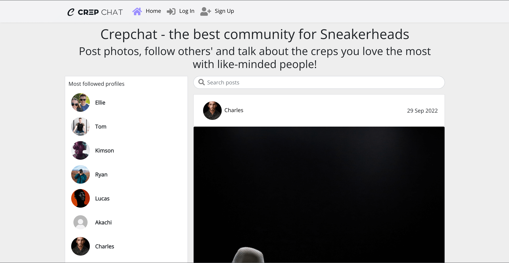

### Logo and Navigation Bar

- Featured and consistent on the all pages
- Two variants of the navbar:
  - New or logged out users will see the login and sign up pages, along with Home if they wish to see posts without interactin with them
  - Logged in users will see more options to interact with the site and see their profile avatar.
- User stories covered: 1, 2, 5, 7, 8

See feature screenshots

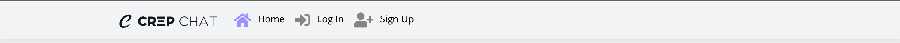
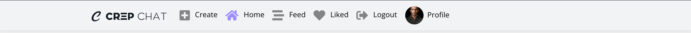
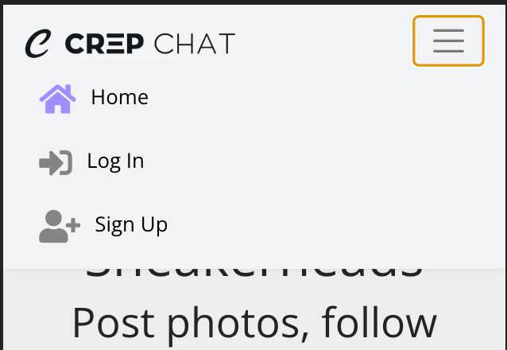
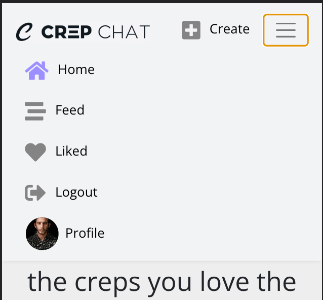

### Sign up form

- New users can create an account
- The user must provide a unique username, password and password confirmation.
- Once registered, the user is redirected to the login page to log in to their newly created account.
- Feedback is displayed if the username is taken, the passwords don't match or are too weak, or if any fields are missing.
- User stories covered: 3

See feature screenshots

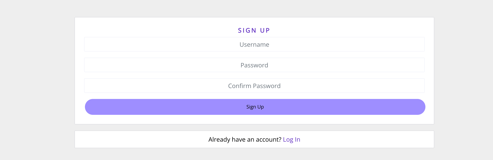
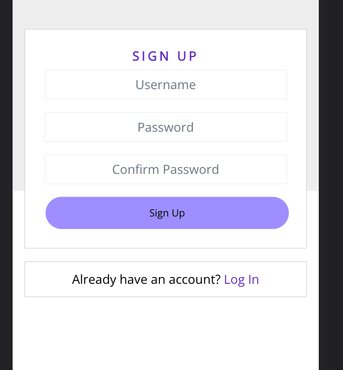

### Login form

- Returning users can login to their account
- The user must have an account in the system and they must enter the correct username and password
- Both fields are mandatory
- Once logged in the user will be navigated to the main posts page
- Feedback messages show if a field is missing, or the credentials aren't valid
- User stories covered: 4

See feature screenshot

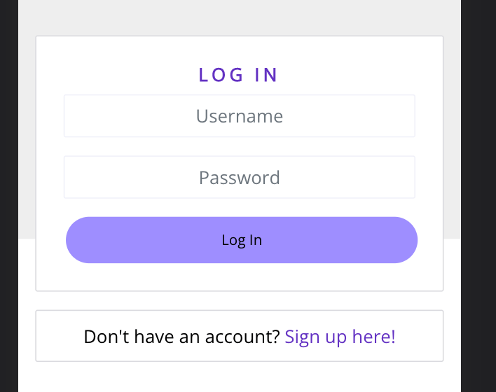

### Post create/update form

- Contains caption, category and image fields
- Allows user to share their pictures with others
- Allows user to categorise their post and write a caption about what it is.
- caption is optional
- feedback is given if the user forgets to upload an image or choose a category.
- User stories covered: 7, 8

See feature screenshots

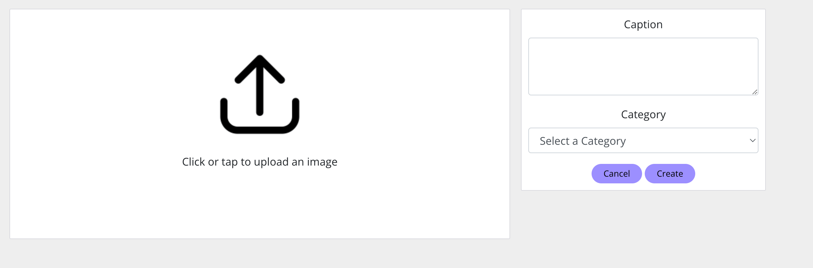

### Post page

- Contains details of a single post - caption, category and the image
- Contains number of likes, comments and dislikes the post has
- Contains like and dislike icons to interact with.
- Features comments section below the post, which update when a new one is posted, listed latest first.
- User stories covered: 9, 10, 26, 27, 36, 49

See feature screenshot

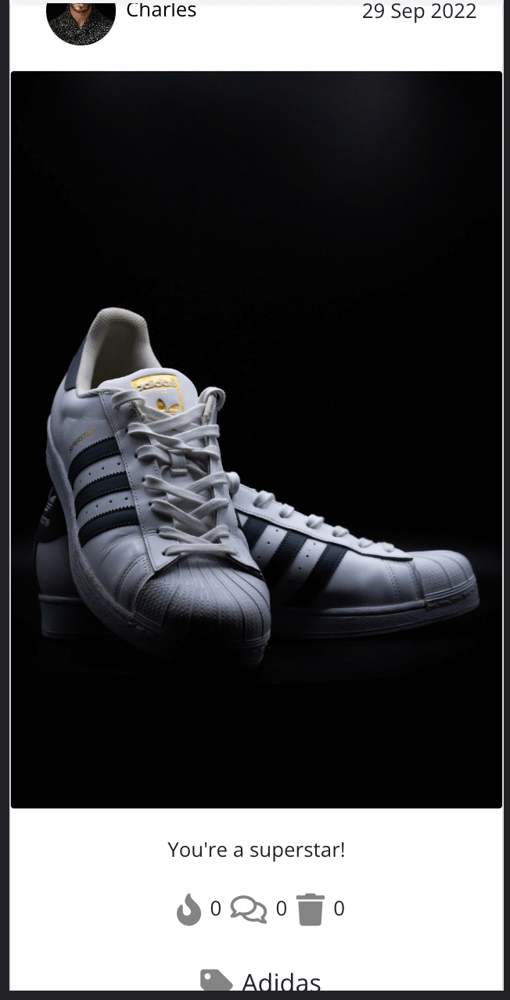

### Comments Section

- Enable users to share their opinion on a specific post
- Users have an option to update or delete the comment
- Display passed time since adding/updating the comment (e.g. 4 minutes ago)
- User stories covered: 13, 14, 15, 37, 38, 39, 40, 41

See feature screenshot

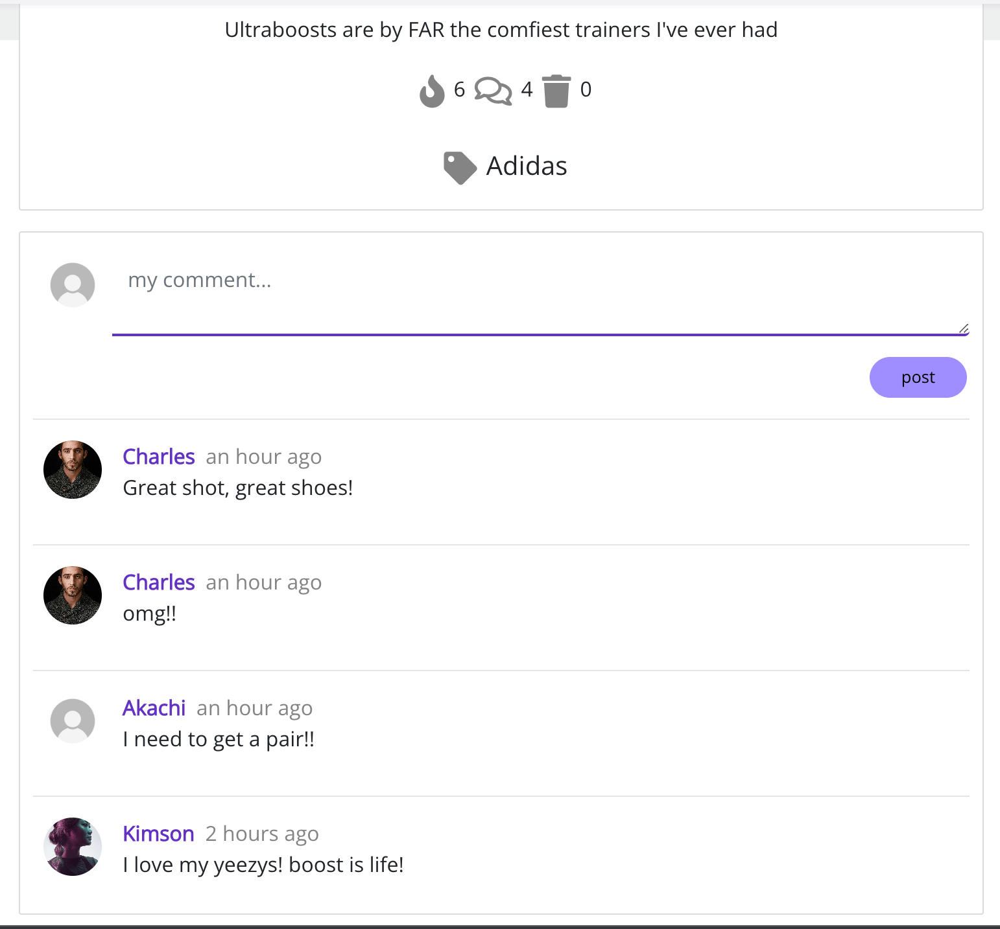

### Likes Section

- Allow user to rate the post
- Like icons are marked red if user has liked/disliked the post
- User cannot like their own posts
- Allow user to narrow their search to liked posts only when clicked on the 'liked option in the navbar menu
- User stories covered: 11, 14, 26, 27, 28, 34, 35

See feature screenshots

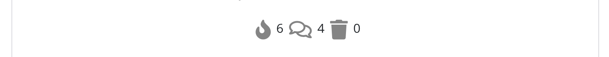

### Profile page

- Contains information about the user
- Displays info how many posts and followers user has and how many users they are following
- Displays profile information if it was provided by the profile owner
- Contains a dropdown menu to edit the profile details, username and password
- User stories covered: 4, 5, 6, 19, 28, 29, 30

See feature screenshot

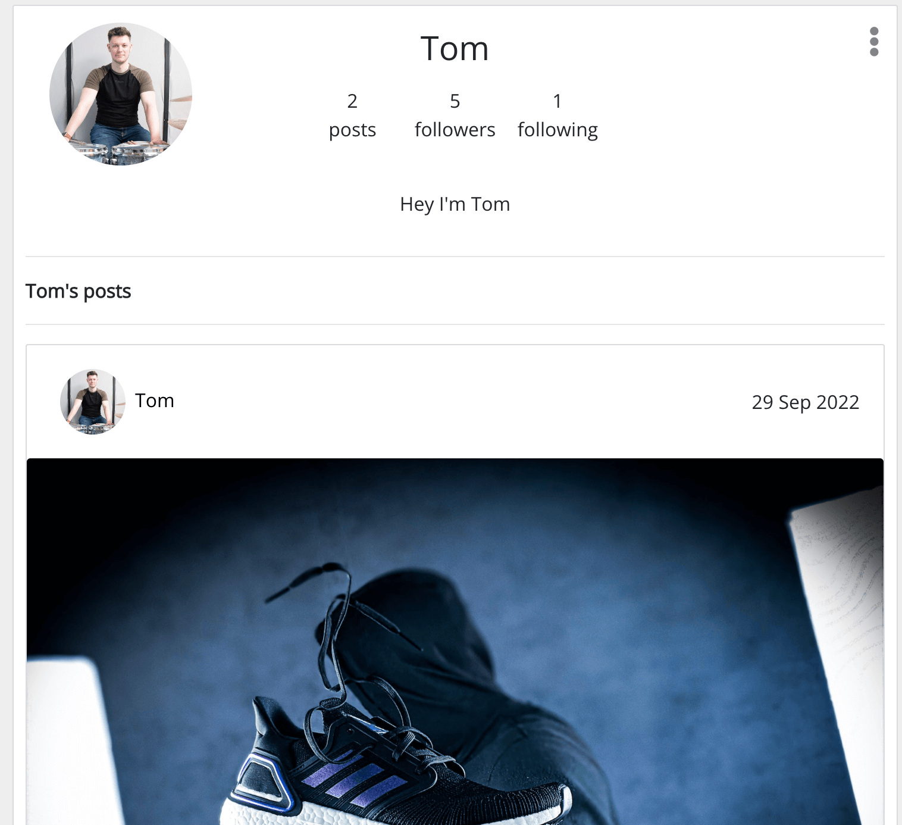

### Profile Avatar

- Allow users to change their default avatar to their own avatar or picture
- Displayed in the navbar, at top of the post, within profile page and by next to comments
- Displayed within 'Most Followed Profiles' section
- User stories covered: 8

See feature screenshot

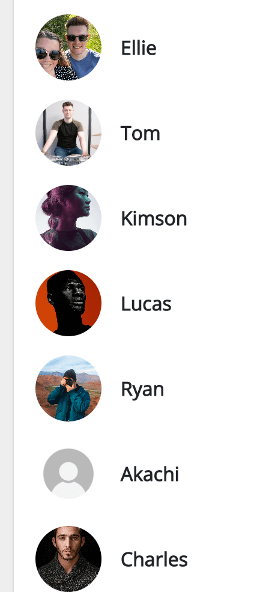

### Password change form

- Allows user to change their profile password
- Contains password criteria visible on hover/tap of ‘view password criteria’ button
- User stories covered: 31

See feature screenshots

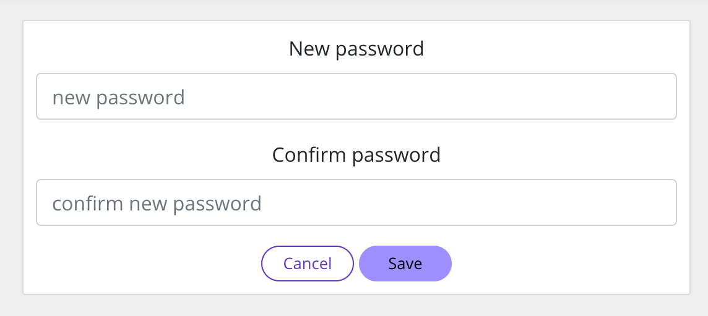

### Infinite scroll

- Allows user to scroll through the content without having to select the next/previous page
- Used for the posts and comments
- Improves general user experience and user engagement
- Displays the loading spinner before loading if the internet speed is too slow
- User stories covered: 16

### Follow/unfollow

- Users are able to follow a specific profile they like and then be able to easily view their posts in the Feed
- User stories covered: 16, 17, 32

See feature screenshot

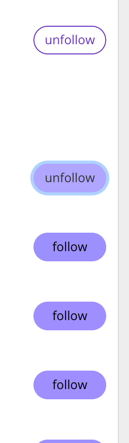

### 'home' 'liked', feed’ menu

- Filters content by user interaction.
- Features all posts, posts by followed users, liked posts
- User stories covered: 11, 12, 15, 18

See feature screenshots

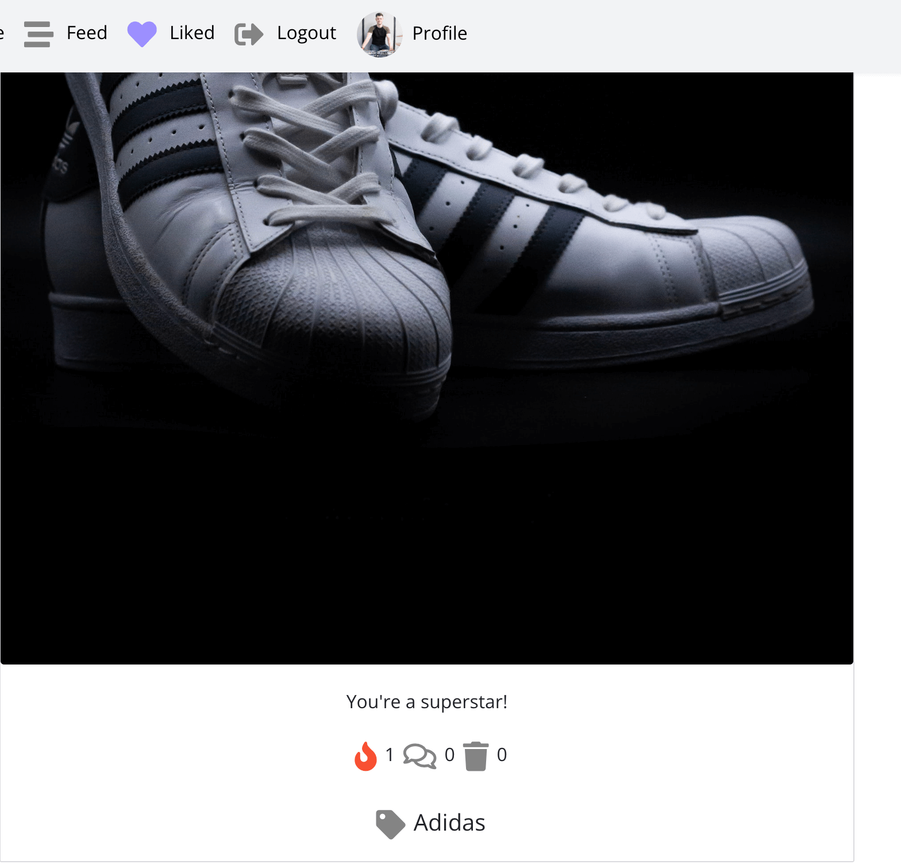
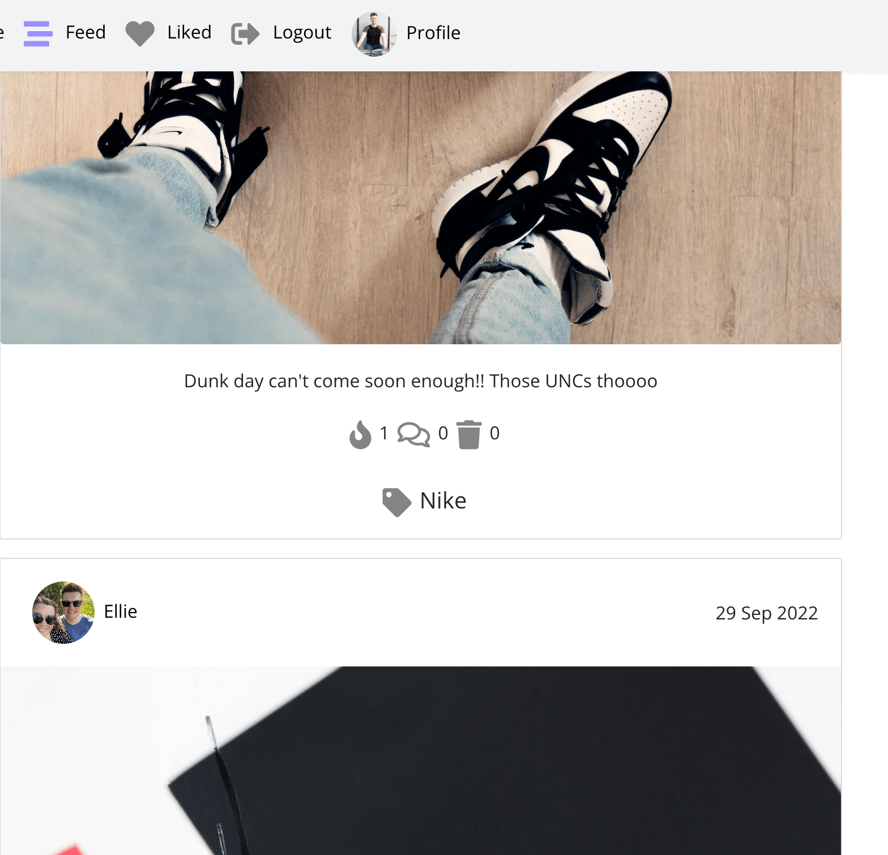

### Most Followed Users

- Displays three most followed users in the app
- Contains follow buttons next to username which allow following these users
- Featured on the majority of pages (except for edit post/profile or change password)
- User stories covered: 33

See feature screenshots

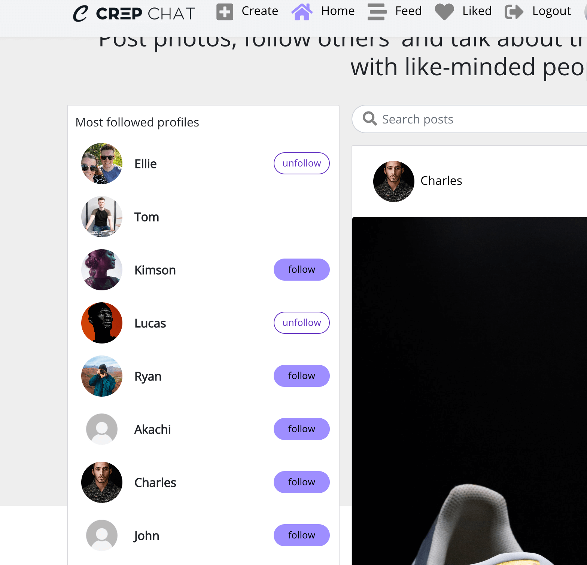
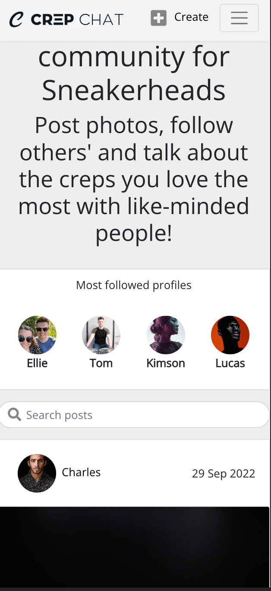

### Search bar

- By typing a phrase in the search bar users can find a specific post or a user they are looking for
- Allows to search through all post title or users
- User stories covered: 13

See feature screenshots

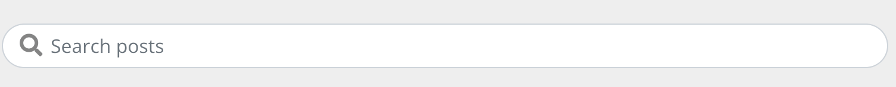

### 404 error page

- Displays if the user enters a URL that does not exist
- Features a button to return to the homepage
- User stories covered: 50

See feature screenshot

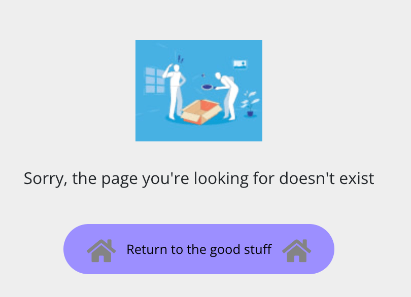

## Future Development

- Add filtered page for post categories, so users can choose to see posts from a particular brand
- Add Reviews section with more detailed views on a particular shoe
- Change like/dislike functionality so that users cannot have 1 of each, and they update together
- Add comment likes
- Add comment replies to open a comment thread
- Add direct messaging between users
- Add email registration rather than just username
- Password recovery via email
- Add notifications and make the site a progressive web app to show notification icons
- Admin permissions so that certain admin users can monitor content and comments added to keep users safe
- Add a marketplace type function so users can buy, sell and trade their sneakers

## Testing

Manual tests were carried out to ensure all functionality added to the site is working as expected

I went through the site and checked that all links and buttons were working, including:

### Navbar Tests

- Navbar links for logged out users
  - Logo routes to homepage
  - Home routes to homepage
  - Log in routes to login page
  - Sign up routes to signup page
- Navbar links for logged in users
  - Create routes to create post page
  - Logo routes to homepage
  - Home routes to homepage
  - Feed routes to feed page filtered by 'followed' user posts
  - Liked routes to liked page filtered by 'liked' user posts
  - Logout routes to homepage and logs the user out
  - Avatar and Profile route to logged in users profile page

### Post Tests

- Clicking on a post routes to that posts' PostPage
- While on a PostPage, clicking the 3 dots in the top right opens the edit/delete menu
- Clicking edit routes to the edit post page, with any current data displayed so the user knows what they've already added
- Clicking delete sends a delete request, and reroutes to the last page that the user was on
- Clicking the Comment icon on a post routes to that posts' PostPage
- Like icon adds or removes a like as expected, updating the likes_count, and is updated in the backed likes table
- Dislike icon adds or removes a dislike as expected, updating the dislikes_count, and is updated in the backend dislikes table
- Follow/Unfollow buttons on the Most followed profiles work as expected, updating the state in real time, and updating the backed Followers table
- Follow/Unfollow buttons on a profile page work as expected, updating the state in real time, and updating the backed Followers table
- Clicking the change image button opens the users os folders for them to upload a saved photo from their device

### Profile Tests

- Most followed Avatar links to profile page
- Three dots in the top right of a profile opens editing options
- Clicking edit profile routes to the edit page, displaying the users current profile and bio content.
- Clicking the change image button opens the users os folders for them to upload a saved photo from their device
- Clicking change username routes to a form to change the username, with the current one displayed as the value
- Clicking change password routes to a form to enter and confirm a new password
- Clicking the cancel button returns to the previos page
- Clicking the save button saves the new data to the backend, and updated the profile state to match

### Comments Tests

- post button in the comments section works as expected, adding the comment to the top of the list, and updating the 'comment_count' state
- comments_count displays on all pages that feature one or more posts
- When adding or removing a comment, the comments_count state changes to reflect it, and the backend updates
- The comment date is updated when adding or editing a comment
- When clicking the three dots in the top right of the comment, and menu opens to show an edit and delete button
- Clicking edit opens the comment up to edit, with the current comment shown. Clicking post then saves this comment and the date becomes the updated time
- Clicking delete removes the comment, adjusts the comments_count state, and moves the other comments to the top in order

## Deployment

This application has been deployed from GitHub to Heroku by following the steps:

1. Create or log in to your account on [Heroku.com](https://www.heroku.com/))
2. Create a new app, add a unique app name (this project is named "crepchat") and choose your region
3. Click on create app

4. Push your changes to GitHub

5. Push the code to Heroku using the command git push heroku main
6. Log in to heroku.com and open the dashboard for your react application (remember this is separate from the DRF application that runs your API)
7. Select the “Deploy” tab in the dashboard
8. Scroll down to the bottom and then select “Deploy Branch”
9. Wait for your build to complete (you can click “view build log” to watch the process in a larger window)
10. When you see the message “deployed to Heroku” in the build log, click the “open app” button at the top of the page.
11. Congratulations, you've deployed your front-end application to Heroku!

## Technologies used

### Languages

- HTML
  - Used for the template structures
- CSS
  - Used to style the markup
- Javascript

### Libraries, frameworks and dependencies

- [React](https://reactjs.org/)
  - Javascript library for building the component based UI and avoiding having to refresh to display dynamic content
- [ESLint](https://eslint.org/)
  - Linter for error checking and syntax analysis
- [React Bootstrap](https://react-bootstrap.github.io/)
  - CSS framework for styled components
- [Axios](https://axios-http.com/)
  - Promise based http client for making http requests to the backend API
- [Cloudinary](https://cloudinary.com/)
  - Used to store static files and media.
- [Google Fonts](https://fonts.google.com/)
  - Used for the app fonts throughout
- [Font Awesome](https://fontawesome.com/)
  - Used for the icons features around the site on the navbar and posts
- [Popper](https://popper.js.org/)
  - Used to make sure the MoreDropdown menu appears correctly on multiple browsers
- [React Infinite Scroll](https://www.npmjs.com/package/react-infinite-scroll-component)
  - Used to easily load extra content rather than paginating pages, for a better UX
- [React Router](https://v5.reactrouter.com/web/guides/philosophy)
  - Used to dynamically load pages and aid site navigation for the user.

### Development Tools and Programs

- [Heroku](https://dashboard.heroku.com)
  - for deployment and hosting
- [Heroku Postgres](https://elements.heroku.com/addons/heroku-postgresql)
  - used for the database
- [Markdown All in One](https://marketplace.visualstudio.com/items?itemName=yzhang.markdown-all-in-one)

  - Readme formatting

- [Postman](https://www.postman.com/)
  - Testing http requests during development
- [Balsamiq](https://balsamiq.com/) for creating the wireframes
- [VS Code](https://code.visualstudio.com/) Used during development to write code
- [GitHub](https://github.com/)
  - Used for version control throughout the build process
  - GitHub Projects used to organise user stories and tasks.
- [Lucid Charts](https://lucid.app/)
  - Used for the site flow and ERD diagrams.
- [Coolers](https://coolors.co)
  - for the site colour scheme.
- [Favicon.io](https://favicon.io/)
  - For the site favicon and manifest
- [flaticon.com](https://www.flaticon.com/free-icon/upload_3097412?term=upload&page=1&position=1&page=1&position=1&related_id=3097412&origin=tag)
  - For the upload image icon

## Honourable Mentions

- Spencer Barriball - My mentor throughout the project. Always able to answer any questions I have and is such a positive person to have around.
- Ellie Pitkin - My partner who is always so understanding when I'm stuck in a rut or need to spend extra time to push through a problem. I couldn't ask for a more supportive person to have around me during this.
- The Code Institute slack community for always being supportive and having an answer to my questions pretty much all the time!

## Credits

- [Code Institute](https://codeinstitute.net/full-stack-software-development-diploma/?utm_term=code%20institute&utm_campaign=CI+-+UK+-+Search+-+Brand&utm_source=adwords&utm_medium=ppc&hsa_acc=8983321581&hsa_cam=1578649861&hsa_grp=62188641240&hsa_ad=581730217381&hsa_src=g&hsa_tgt=kwd-319867646331&hsa_kw=code%20institute&hsa_mt=e&hsa_net=adwords&hsa_ver=3&gclid=CjwKCAjwm8WZBhBUEiwA178UnL1yYZ4TCqpEYl__6IceaLdPrDDLtFgZQYygGXkvj5IS4fZ5dLji8BoCbnQQAvD_BwE)

  - For the boilerplate code used throughout the project and adapted from their Moments walkthrough tutorial. It was a huge part in me learning React and being able to build this project.

- [Unsplash](https://unsplash.com/)
  - For the post and profile images used throughout
- [Aleksandra Haniok](https://www.linkedin.com/in/aleksandrahaniok/)
  - For the features readme layout
